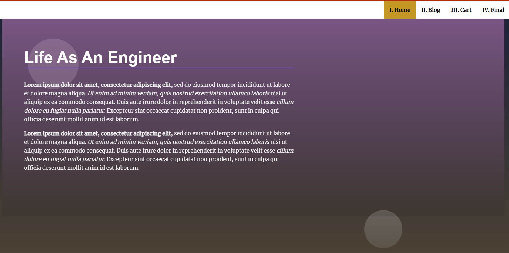

# :framed_picture: Landing Page Project

## Table of Contents

* [Project_Description](#memo-project-description)
* [View Project](#electric_plug-view-project)
* [How_to_Contribute](#pen-how-to-contribute)
* [Resources](#books)
* [Preview](#computer-preview)
* [License](#ballot_box_with_check-license)

## :memo: Project Description

Project originally created by Udacity Team. Some HTML&CSS styling along with added Javascript functionality
were added by @WarriorDevKev to accomplish project requirements.

## :electric_plug: View Project

Project can be viewed from browser.

## :pen: How to Contribute

This repo is avaiable to be forked!

## :books: Resources
Udacity classroom module, library books and their access to online learning academys.  YouTube videos, Session Leads and Self-Initiated Peer Study Sessions.

## :computer: Preview
Have a sneak peek 😉

## :ballot_box_with_check: License

[License](LICENSE.txt)

[(Back to top)](#table-of-contents)
